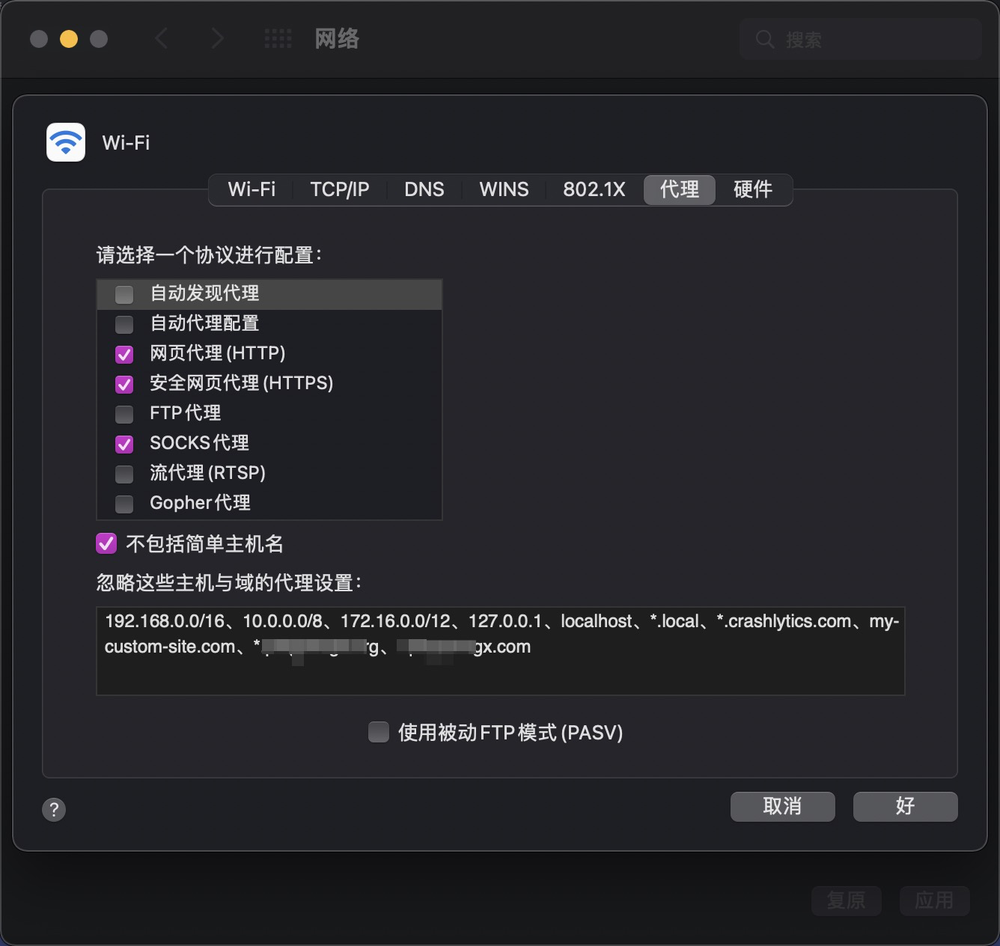

## Mac 配置 Clashx 代理设置代理配置忽略主机与域的代理


##### Question：开启clashx，能访问外网，但无法访问局域网网站，需要配置

##### 尝试解决：手动设置 mac 网络代理

##### 	系统偏好设置 - 网络 - 高级 - 代理 - 忽略这些主机与域的代理设置

##### 	在此处写入你需要忽略代理的域名；如下图：



##### 	保存 - 应用，成功！

##### 	然而，它存在一个问题，在每次重启clashx后，此处的代理配置会复原。

##### 	代理根据clashx配置文件自动生成，所以我们需要去更改clashx的配置文件。


#### 终极解决方案：

##### 	在 ~/.config/clash/ 新建 proxyIgnoreList.plist文件

```
touch ~/.config/clash/proxyIgnoreList.plist
```

##### 	写入：

```
<?xml version="1.0" encoding="UTF-8"?>
<!DOCTYPE plist PUBLIC "-//Apple//DTD PLIST 1.0//EN" "http://www.apple.com/DTDs/PropertyList-1.0.dtd">
<plist version="1.0">
<array>
    <string>192.168.0.0/16</string>
    <string>10.0.0.0/8</string>
    <string>172.16.0.0/12</string>
    <string>127.0.0.1</string>
    <string>localhost</string>
    <string>*.local</string>
    <string>*.crashlytics.com</string>
    <string>my-custom-site.com</string>
</array>
</plist>
```

##### 	在 <array> 中增加自定义需要忽略的域名地址：eg

```
<string>*.xxxx.com</string>
<string>*.xxxx.org</string>
```

##### 	保存 - 重启 ，完美解决！
